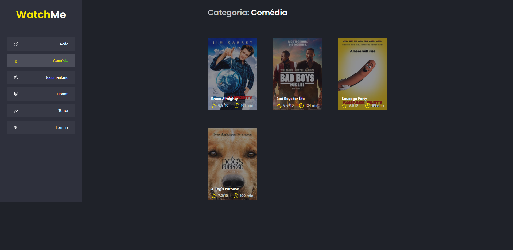

<!-- <h1 align="center">
🚧 UpFi | Em Construção 🚧
</h1> -->

<h1 align="center">
    Bem Vindo ao WatchMe
</h1>

<p align="center">
  <a href="#page_facing_up-sobre-o-projeto">Sobre o Projeto</a>&nbsp;&nbsp;&nbsp;|&nbsp;&nbsp;&nbsp;
  <a href="#computer-demo">Demo</a>&nbsp;&nbsp;&nbsp;|&nbsp;&nbsp;&nbsp;
  <a href="#art-layout">Layout</a>&nbsp;&nbsp;&nbsp;|&nbsp;&nbsp;&nbsp;
  <a href="#hammer-Tecnologias">Tecnologias</a>&nbsp;&nbsp;&nbsp;|&nbsp;&nbsp;&nbsp;
  <a href="#blue_book-instalação">Instalação</a>&nbsp;&nbsp;&nbsp;|&nbsp;&nbsp;&nbsp;
  <a href="#astronaut-Autor">Autor</a>&nbsp;&nbsp;&nbsp;|&nbsp;&nbsp;&nbsp;
  <a href="#memo-Licença">Licença</a>
</p>

<!-- ## :information_source: O que é Next Level Week?

O [NLW](https://nextlevelweek.com/inscricao/1) é uma semana prática com muito código, desafios, network e com um único objetivo: levá-lo ao próximo nível.
Através do método da [Rocketseat](https://nextlevelweek.com/inscricao/1), você aprenderá novas ferramentas, tecnologias e descobrirá hacks que irão impulsionar sua carreira.
Um evento online e totalmente gratuito que o ajudará a dar o próximo passo na sua evolução como desenvolvedor.
 -->

## :page_facing_up:🚀 Sobre o Projeto

Nesse desafio, você deverá criar uma aplicação para treinar o que aprendeu até agora no ReactJS

Essa será uma aplicação onde o seu principal objetivo é refatorar uma página para listagem de filmes de acordo com gênero.

A aplicação já está totalmente funcional mas grande parte do seu código está diretamente no arquivo App.tsx. Para resolver isso da melhor forma, é necessário dividir a aplicação em pelo menos duas partes principais: sidebar e o conteúdo principal que possui o header e a listagem de filmes.


## :art: Layout

https://github.com/danilo-vieira/ignite-template-otimizando-a-aplicacao

### Web

<h4 align="center">
  
</h4>

## :hammer: Tecnologias:

- `dependencies`:
- **[React](https://pt-br.reactjs.org/docs/create-a-new-react-app.html)**
- **[React Testing Library](https://testing-library.com/docs/react-testing-library/intro)**
- **[json-server](https://github.com/typicode/json-server)**
- **[web-vitals](https://github.com/axios/axios)**
- **[Axios](https://github.com/axios/axios)**

- `devDependencies`:
- **[TypeScript](https://www.typescriptlang.org/)**

<!--
- **[faunaBD](https://fauna.com/)**
- **[imgBB](https://imgbb.com/)**
- **[framer-motion](https://www.framer.com/motion/)**
- **[NextJS](https://nextjs.org/)**
- **[@chakra-ui/core](https://chakra-ui.com/)**
- **[react-country-flag](https://www.npmjs.com/package/react-country-flag)**
- **[swiper](https://swiperjs.com/react)**
- **[sass](https://sass-lang.com/)**
- **[Date-fns](https://date-fns.org/)**
- **[babel](https://babeljs.io/)**
- **[webpack](https://webpack.js.org/)**
- **[node-sass](https://github.com/sass/node-sass)**
- **[react-feather](https://github.com/feathericons/react-feather)**
- **[immer](https://immerjs.github.io/immer/)**
- **[react-redux](https://react-redux.js.org/)**
- **[react-saga](https://github.com/redux-saga/redux-saga)**
- **[react-modal](https://github.com/reactjs/react-modal)**
- **[Polished](https://polished.js.org/)**
- **[react-toastify](https://github.com/fkhadra/react-toastify)**
- **[miragejs](https://miragejs.com/)**
- **[Firebase](https://firebase.google.com/?hl=pt-br)**
- **[Jest](https://jestjs.io/)**
- **[Storybook](https://storybook.js.org/)**
- **[Eslint](https://eslint.org/)**
- **[Prettier](https://prettier.io/)**
- **[Husky](https://github.com/typicode/husky)**
- **[PlopJS](https://plopjs.com/)**
- **[Styled-Icons](https://styled-icons.js.org/)**
 -->

## :blue_book: Instalação

## 🔎 Comandos

- `dev`: Executa a aplicação em `localhost:8080`
- `build`: Cria a Build do projeto
- `start`: Executa a aplicação em produção
- `server`: Executa o servidor fake `localhost:3333`
  <!-- - `test`: Executa **Jest** para testar todos os componentes e páginas -->
  <!-- - `eject`: Executa **Jest** em watch mode -->

## 🚀 Como rodar este projeto

Para clonar e executar este aplicativo, você precisará de [Git](https://git-scm.com) e [NodeJs](https://nodejs.org/en/) Instalado em seu computador.

### 🌀 Clonando o repositório

```bash
# Clone este repositório
$ git clone https://github.com/DiogoMiranda-dev/ignite-chapter5-desafio-one

# Acesse a pasta do projeto no terminal/cmd
$ cd ignite-chapter4-desafio-two
```

### 🎲 Rodando a Aplicação

```bash
# Instale as dependências
$ yarn install

# Execute a Aplicação em Desenvolvimento
$ yarn dev
# O servidor inciará na porta:3000 - acesse http://localhost:8080

```
<!-- # Execute o server fake
$ yarn server
# O servidor inciará na porta:3333 - acesse http://localhost:3333 -->

### 💾 Comandos Úteis

```bash
#Rodar os testes
$ yarn test
```

<!--
### 📁 Configuração .ENV

 ```bash
#adicionado .env.example no projeto, lembrar de adicionar as variáveis de ambiente conforme o exemplo

# FIREBASE
NEXT_PUBLIC_APIKEY=
NEXT_PUBLIC_AUTHDOMAIN=
NEXT_PUBLIC_PROJECTID=
NEXT_PUBLIC_STORAGEBUCKET=
NEXT_PUBLIC_MESSAGINGSENDERID=
NEXT_PUBLIC_APPID=
NEXT_PUBLIC_MEASUREMENTID=

# MONGODB
MONGODB_URI=

# API URLS
BASE_URL=

```
 -->

## :astronaut: Autor

<a href="https://github.com/DiogoMiranda-dev/">
 
 <br />
  
</a>
<a href="https://www.linkedin.com/in/diogo-miranda-2233657a/">
  
</a>
<a href="https://www.instagram.com/diogomiranda.dev/">
  
</a>

Feito com ❤️ por Diogo Miranda 🥇 :astronaut: [https://diogomiranda.dev.br/](https://diogomiranda.dev.br/)

## :memo: Licença

Este projeto esta sobe a licença MIT. Veja a [LICENÇA](https://opensource.org/licenses/MIT) para saber mais.
